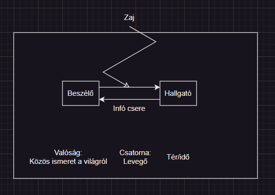

# 1\. A nyelvi kommunikáció tényezői  
  
- Csatorna  
- Tér/idő  
- Zaj  
# 2\. A nyelvi kommunikáció funkciói  
- 3 fő funkciója (szerepe) van  
	1. Közlés/Tájékoztatás -> Kijelentő mondat (.)  
	2. Érzelem kifejezés -> Kijelentő (.) vagy felkiáltó (!) mondat  
	3. Felhívó jelleg -> Felkiáltó/felszólító mondat (!) vagy kérdő is lehet (?)  
# 3\. Nem nyelvi kommunikáció (Metakommunikáció)  
- Beszédet kísérő nem nyelvi jelek  
- Fajtái:  
	- Mimika/arcjáték ("felhúzta az orrát")  
	- Gesztikuláció, gesztusok  
		- Fej,  
		- Váll,  
		- Kéz által közölt jelek  
	- Testtartás  
	- Tekintet -> Szem üzenete  
	- Térköz -> Távolság a felek között  
# 4\. Reklámok funkciója, működése  
- Tömegkommunikációhoz kapcsolható  
	- Egyirányú  
	- Közvetett (valamilyen csatornán keresztül megy az infó)  
- Adó: forrás, pl. Médium, stb.  
- Vevő: célzott közönség  
- Funkció:  
	- Kereskedelmi cél, pl. vásárolj, fogyassz  
	- Társadalmi cél, pl. segítségadás, adományozás, véradás  
- Működése  
	- Manipuláció (befolyásolás, +/-)  
	- Eszközrendszere  
		- Kép  
		- Hang  
		- Szöveg  
