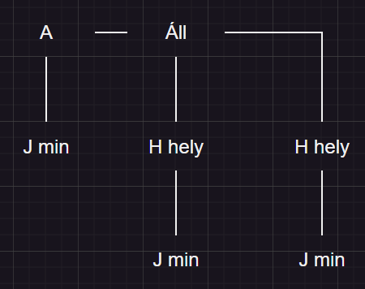
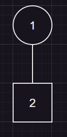

# 9\. Hangtörvények  
## Magánhangzók  
- Hangrend  
	- Magas  
	- Mély  
	- Vegyes  
- Illeszkedés: Toldalékolás  
	- Perec|et (Magas)  
	- Autó|val (Mély)  
	- Virág|gal (Vegyes)  
- Hiátus  
	- Dió -> "Dijó"  
	- Tea -> "Teja"  
	- Fiú -> "Fijú"  
## Mássalhangzók  
- Írásban jelölt teljes hasonulás  
	- vas + val = vassal  
- Írásban jelöletlen teljes hasonulás  
	- anya + a = anyja  
- Részleges hasonulás  
	- Zöngésség szerinti  
		- Megváltozik a zöngéssége egy hangnak  
		- hozta -> "hoszta"  
		- csúszda -> "csúzda"  
	- Képzés helye szerinti részleges hasonulás  
		- nb: azonban -> "azomban"  
		- np: színpad -> "szímpad"  
	- Összeolvadás  
		- 2 hangból egy harmadik hang kiejtéskor  
		- Játszik -> "jáccik"  
		- Szabadság -> "szabaccság"  
		- Tudja -> "Tuggya"  
	- Rövidülés  
		- Hallgat -> "Halgat"  
		- Jobbra -> "Jobra"  
	- Kiesés  
		- 1 hang kiesik  
		- Mondta -> "Monta"  
		- Mindnyájan -> "Minnyájan"  
	- Nyúlás  
		- s: kisebb -> "Kissebb"  
		- gy: együttes -> "Eggyüttes"  
# 10\. Szófajok  
## Szófajok  
- Igék (!)  
- Névszók (!)  
- Viszonyszók (Igekötő, névelő, névutó, segédige)  
- Mondatszók  
## Névszók  
- Főnév  
	- Tulajdonnév  
	- Köznév  
		- Egyedi  
		- Gyűjtő  
		- Anyagnév  
- Melléknév  
	- "Milyen?"  
- Számnév  
	- Határozott  
		- Tőszámnév  
			- Egy  
			- Kettő  
		- Sorszámnév  
			- Első  
			- Második  
		- Törtszámnév  
			- Hat heted  
			- Három negyed  
	- Határozatlan  
		- Sok  
		- Kevés  
		- Rengeteg  
		- Maroknyi  
- Igenév  
	- Főnévi: -ni képző (látni)  
	- Melléknévi:  
		- Futó ember  
		- Lefut**ott** film  
		- Érlel**t** szilva  
	- Beálló: megtanul**andó**  
- Névmás  
	- Személyes névmás: én, te, ő, mi, ti, ők  
	- Mutató: olyan, azt, az, stb.  
	- Birtokos: Enyém, tiéd, ővé, stb.  
	- Határozatlan: Valaki, valahol, valamikor (vala-)  
	- Általános: Mindenki, senki, bárki  
# 11\. A mondat csoportosítása szerkezete szerint  
- A mondat:  
	- Kommunikációs alapegység (szóban/írásban)  
	- Jelentése van  
	- Funkciója  
		- Közlés  
		- Érzelem kifejezés  
		- Felhívás  
- Csoportosítása  
	- Szerves  
		- Egyszerű (1 tagmondat)  
			- Tőmondat  
				- Alany  
				- Állítmány  
			- Bővített  
				- Tárgy  
				- Határozó  
				- Jelző  
		- Összetett (2 vagy több tagmondat)  
			- Alárendelő  
				- Alanyi  
				- Állítmányi  
				- Tárgyas  
				- Határozói  
				- Jelzői  
			- Mellérendelő  
				- Kapcsolatos  
				- Ellentétes  
				- Következtető  
				- Magyarázó  
				- Választó  
	- Szervetlen  
		- "Ó, jaj!"  
- Pl.  
	- "Zöld erdőben magas fákon fészkel a kicsi madár"  
		- Egyszerű Bővített szerves  
		  
	- "Sokat beszél, keveset mond"  
		- (1)<=>(2)  
	- "Nyári idő lesz ma, ezért lemegyek a strandra"  
		- (1)->(2)  
	- "Tudod, hogy nincs bocsánat"  
		- Utalószó: "azt" -> Mit? -> Tárgy  
		-   
